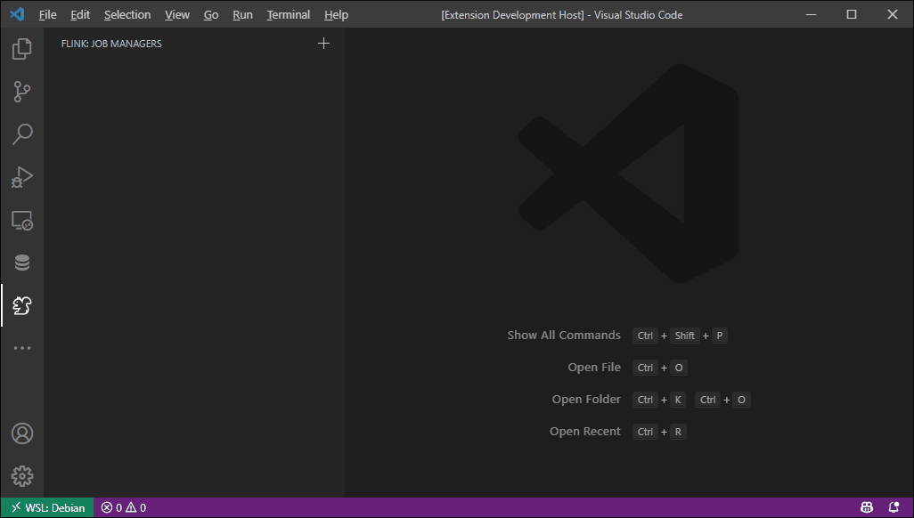

# a Visual Studio Code Extension for Apache Flink

This extension provides a set of commands and UIs to manage Apache Flink jobs in Visual Studio Code.

## Features

> Under heavy construction. Stay tuned.

## Credits

- [json-schema-to-typescript](https://github.com/bcherny/json-schema-to-typescript) - Compile JSONSchema to TypeScript type declarations
